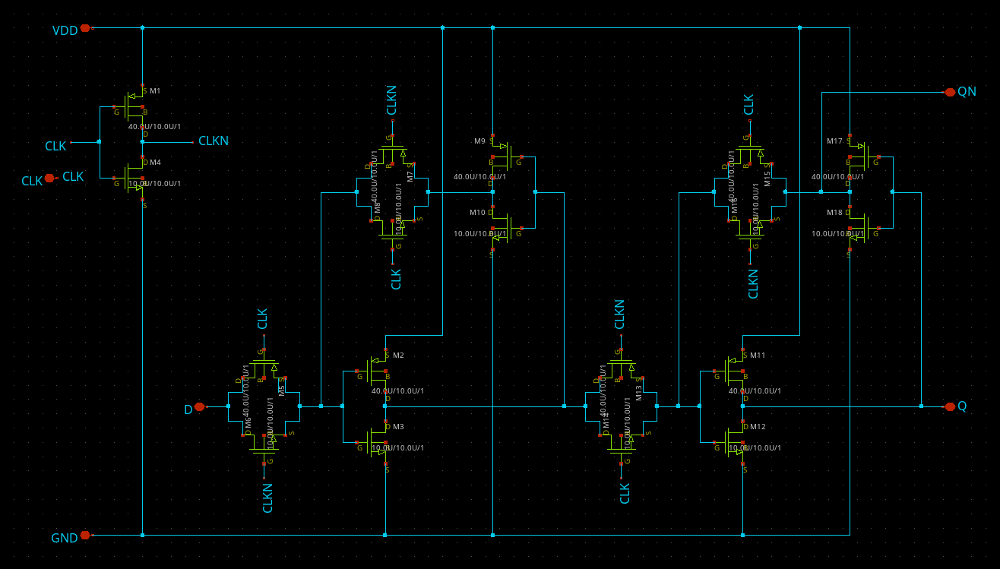

# Transmission-Gate D Flip-Flop

This repository contains the schematic and layout of a transmission-gate D-FF (TGFF) for the Minimal Fab design contest. The functionality was verified with a transient simulation. The final layout was validated using DRC and LVS.

# Schematic

# Simulation

# Layout

# DRC

# LVS

# License

Copyright (c) 2023 Leo Moser

This work is licensed under the Apache License, Version 2.0